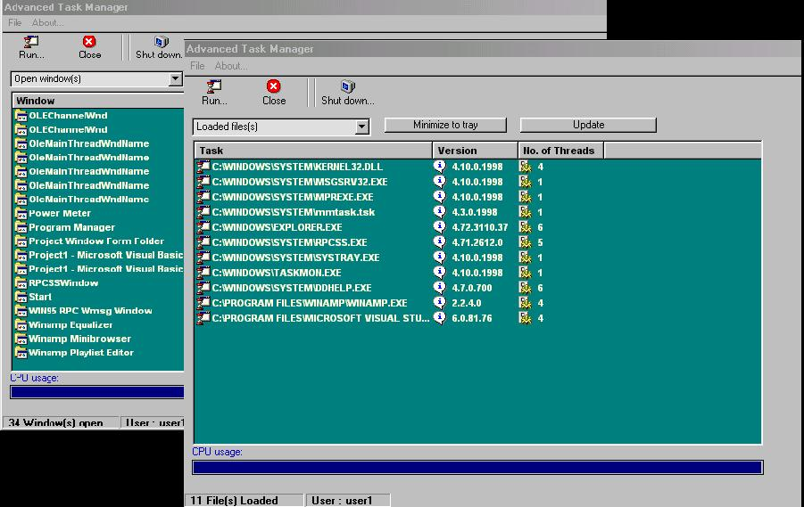



## Advanced Task Manager \- Shows both loaded files / dll's and windows

### Description

Shows running executables and dll's, with their

version and threads no. also shows

all the open windows and child-windows, giving an

option to close each one, featuring a cpu usage meter and

many usefull API's, if you like it please vote.
 
### More Info
 
Be carefull not to close important app's

             |
---                |---
**Submitted On**   |2000-07-12 11:05:00
**By**             |[ShookyN@GAR](https://github.com/Planet-Source-Code/PSCIndex/blob/master/ByAuthor/shookyn-gar.md)
**Level**          |Advanced
**User Rating**    |4.2 (25 globes from 6 users)
**Compatibility**  |VB 3\.0, VB 4\.0 \(16\-bit\), VB 4\.0 \(32\-bit\), VB 5\.0, VB 6\.0, VB Script, ASP \(Active Server Pages\) 
**Category**       |[Complete Applications](https://github.com/Planet-Source-Code/PSCIndex/blob/master/ByCategory/complete-applications__1-27.md)
**World**          |[Visual Basic](https://github.com/Planet-Source-Code/PSCIndex/blob/master/ByWorld/visual-basic.md)
**Archive File**   |[CODE\_UPLOAD77177122000\.zip](https://github.com/Planet-Source-Code/shookyn-gar-advanced-task-manager-shows-both-loaded-files-dll-s-and-windows__1-9704/archive/master.zip)

### API Declarations

to much - all in the code

